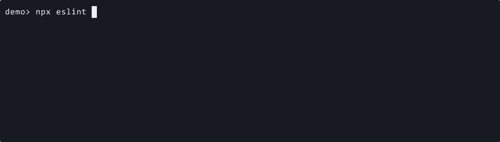
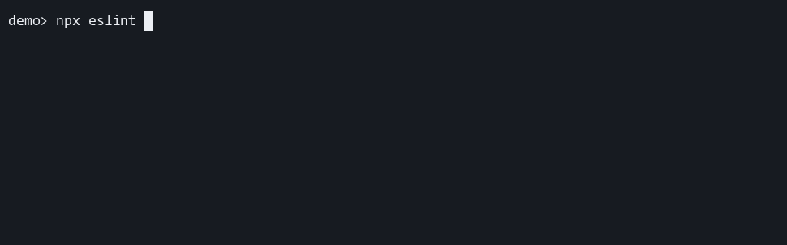

# activate

Display live per-file lint progress in CLI output.

## Targeted pattern scope

This rule is for CLI-oriented ESLint runs where visible progress matters.

It enables the plugin's full live mode, including spinner updates and per-file path repainting.

## What this rule reports

This rule does not report source-code violations.

Enabling it changes ESLint's terminal output behavior for the current run.

## Why this rule exists

Long ESLint runs can feel silent and untrustworthy when the terminal shows no activity while ESLint is still working.

This rule exists to make those runs easier to monitor without changing lint semantics.

## ❌ Incorrect

```ts
import progress from "eslint-plugin-file-progress-2";

export default [
  {
    plugins: {
      "file-progress": progress,
    },
    rules: {
      // No live progress will be shown.
      "file-progress/activate": "off",
    },
  },
];
```

## ✅ Correct

```ts
import progress from "eslint-plugin-file-progress-2";

export default [
  {
    plugins: {
      "file-progress": progress,
    },
    rules: {
      "file-progress/activate": [
        "warn",
        {
          outputStream: "stderr",
          throttleMs: 100,
          ttyOnly: true,
        },
      ],
    },
  },
];
```

## Behavior and migration notes

### Rule Options

Use the inline GIF preview under each option section below for quick visual
comparison.

This rule accepts one optional options object:

```ts
interface ProgressRuleOptions {
  detailedSuccess?: boolean;
  failureMark?: string;
  fileNameOnNewLine?: boolean;
  hide?: boolean;
  /**
   * @deprecated Prefer `pathFormat: "basename"`.
   */
  hideDirectoryNames?: boolean;
  hideFileName?: boolean;
  hidePrefix?: boolean;
  mode?: "file" | "compact" | "summary-only";
  minFilesBeforeShow?: number;
  outputStream?: "stderr" | "stdout";
  pathFormat?: "relative" | "basename";
  prefixMark?: string;
  showSummaryWhenHidden?: boolean;
  spinnerStyle?: "arc" | "bounce" | "clock" | "dots" | "line";
  successMark?: string;
  successMessage?: string;
  throttleMs?: number;
  ttyOnly?: boolean;
}
```

Default values:

```ts
{
  detailedSuccess: false,
  failureMark: "✖",
  fileNameOnNewLine: false,
  hide: false,
  hideFileName: false,
  hidePrefix: false,
  minFilesBeforeShow: 0,
  outputStream: "stderr",
  pathFormat: "relative",
  prefixMark: "•",
  showSummaryWhenHidden: false,
  spinnerStyle: "dots",
  successMark: "✔",
  successMessage: "Lint complete.",
  throttleMs: 0,
  ttyOnly: false,
}
```

`hideDirectoryNames` has no standalone default value. It is a deprecated alias
that only matters when `pathFormat` is not set.

`mode` also has no standalone literal default in the options object. When it is
omitted, `activate` stays in its normal per-file live mode.

### How option resolution works

- Rule options are the primary API.
- Deprecated `settings.progress` is still read as a fallback.
- If both are present, rule options win.
- `mode` is the canonical way to select file, compact, or summary-only output
  behavior from this single rule.
- Older `file-progress/compact` and `file-progress/summary-only` configs should
  migrate to `file-progress/activate` with `mode`.
- Unknown or invalid values fall back to the built-in defaults.
- Empty strings for marks and messages are trimmed. Blank values fall back to the
  default text or symbol.
- `hideDirectoryNames: true` resolves to `pathFormat: "basename"` only when
  `pathFormat` is omitted.
- `minFilesBeforeShow` counts files the rule has seen, not lint problems or rule
  reports.

### Option-by-option reference

#### `detailedSuccess`



- Adds duration, file count, throughput, exit code, and problem status to the
  final summary.
- Despite the name, it also expands the failure summary. The same flag controls
  both success and failure detail output.
- It has no effect while live progress is repainting. You only see it at the
  end of the run.

#### `failureMark`


- Changes the symbol inside the failure summary text.
- It does not affect live spinner frames or success output.
- No matching `failureMessage` option exists. The failure message text remains
  `Lint failed.`.

#### `fileNameOnNewLine`


- Splits the live `activate` output into two lines: the plugin prefix first, the
  current file path on the next line.
- This is useful when long paths make the one-line layout feel cramped.
- It has no visible effect when file names are hidden or the prefix is hidden.

#### `hide`



- Hides live output and the final summary.
- If you set only `hide: true`, users will see no plugin output at all.
- Combine it with `showSummaryWhenHidden: true` when you want quiet live output
  but still want a completion signal.

#### `hideDirectoryNames` (deprecated)


- Legacy alias for basename-only path display.
- It is only consulted when `pathFormat` is not set.
- Prefer `pathFormat: "basename"` in new configs so the intent is explicit.

#### `hideFileName`


- Switches `activate` from file-specific live progress to a generic
  `linting project files...` line.
- The final success or failure summary still works normally.
- If this is the behavior you always want, prefer `mode: "compact"` so the
  intent is explicit in config.

#### `hidePrefix`


- Removes the `eslint-plugin-file-progress-2` label from live output and from
  the summary label.
- It leaves `successMark`, `failureMark`, and the message text intact.
- It also suppresses the final spinner mark that would otherwise use
  `prefixMark`.

#### `mode`


- Selects the effective live-output behavior from one canonical rule entry.
- `file` keeps per-file live updates, `compact` uses the generic spinner line,
  and `summary-only` suppresses live updates and keeps only the final summary.
- This is the supported way to choose between the plugin's output modes.

#### `minFilesBeforeShow`


- Suppresses output until at least `N` files have been seen.
- If the whole run finishes below that threshold, the final summary is also
  hidden unless `showSummaryWhenHidden` is enabled.
- This option is about run size, not lint severity. A file with errors still
  counts as only one file.

#### `outputStream`


- Sends progress output to `stderr` (default) or `stdout`.
- `ttyOnly` checks interactivity on the chosen stream, not on both streams.
- Use `stderr` when you want to keep `stdout` cleaner for piping or
  machine-readable output. Use `stdout` only when you explicitly want progress
  mixed into standard output.

#### `pathFormat`


- `relative` shows the path relative to ESLint's current working directory.
- `basename` strips directory segments and shows only the file name.
- It has no visible effect when file names are hidden, because there is no path
  left to format.

#### `prefixMark`


- Changes the small marker used in the live prefix when the plugin label is
  visible.
- The same value is passed to the final spinner renderer when the prefix is not
  hidden.
- It does not replace `successMark` or `failureMark`, which live inside the
  summary text itself.

#### `showSummaryWhenHidden`


- Allows the final summary to print even when live output is hidden by `hide`,
  `ttyOnly`, or `minFilesBeforeShow`.
- It never re-enables live updates. It only affects the end-of-run summary.
- This is the most useful companion option for CI and non-TTY workflows.

#### `spinnerStyle`


- Chooses the live animation frames.
- It only affects live output. It has no visible effect in `summary-only` mode
  or in fully hidden runs.
- Available values are `arc`, `bounce`, `clock`, `dots`, and `line`.

#### `successMark`


- Changes the symbol inside the success summary text.
- It does not affect failure output or live spinner frames.
- This is most noticeable when `hidePrefix` or `detailedSuccess` makes the
  summary itself more prominent.

#### `successMessage`


- Changes the success text after `successMark`.
- Blank strings are trimmed and fall back to `Lint complete.`.
- It does not affect failure summaries.

#### `throttleMs`


- Rate-limits how often the current file path is repainted after the first live
  update.
- It only matters in file-specific live mode. Generic progress mode has no file
  path to repaint on each file.
- This is useful on large repos where per-file repainting feels noisy or causes
  too much terminal churn.

#### `ttyOnly`


- Suppresses output when the selected `outputStream` is not interactive.
- With the default `outputStream: "stderr"`, piping only `stdout` does not hide
  progress if `stderr` is still attached to a terminal.
- Combine it with `showSummaryWhenHidden: true` when you want non-interactive
  runs to stay quiet until the final summary.

### Additional behavior notes

- Prefer rule options over `settings.progress` in all new configs.
- If you want generic live output without per-file paths, prefer
  `mode: "compact"` over `hideFileName: true` because it communicates intent
  directly.
- If you only want the final summary, prefer `mode: "summary-only"` over
  combining `hide`, `showSummaryWhenHidden`, and other heavy overrides.
- `outputStream`, `ttyOnly`, `hide`, `minFilesBeforeShow`, and
  `showSummaryWhenHidden` are the options that most strongly change whether the
  plugin is visible at all.

<details>
<summary><small>Download option demo casts</small></summary>

- [`detailedSuccess`](../docusaurus/static/demos/options/casts/detailed-success.cast)
- [`failureMark`](../docusaurus/static/demos/options/casts/failure-mark.cast)
- [`fileNameOnNewLine`](../docusaurus/static/demos/options/casts/file-name-on-new-line.cast)
- [`hide`](../docusaurus/static/demos/options/casts/hide.cast)
- [`hideDirectoryNames`](../docusaurus/static/demos/options/casts/hide-directory-names.cast)
- [`hideFileName`](../docusaurus/static/demos/options/casts/hide-file-name.cast)
- [`hidePrefix`](../docusaurus/static/demos/options/casts/hide-prefix.cast)
- [`mode: "compact"`](../docusaurus/static/demos/options/casts/mode-compact.cast)
- [`mode: "summary-only"`](../docusaurus/static/demos/options/casts/mode-summary-only.cast)
- [`minFilesBeforeShow`](../docusaurus/static/demos/options/casts/min-files-before-show.cast)
- [`outputStream: "stdout"`](../docusaurus/static/demos/options/casts/output-stream-stdout.cast)
- [`pathFormat: "basename"`](../docusaurus/static/demos/options/casts/path-format-basename.cast)
- [`prefixMark`](../docusaurus/static/demos/options/casts/prefix-mark.cast)
- [`showSummaryWhenHidden`](../docusaurus/static/demos/options/casts/show-summary-when-hidden.cast)
- [`spinnerStyle: "line"`](../docusaurus/static/demos/options/casts/spinner-style-line.cast)
- [`successMark`](../docusaurus/static/demos/options/casts/success-mark.cast)
- [`successMessage`](../docusaurus/static/demos/options/casts/custom-success-message.cast)
- [`throttleMs`](../docusaurus/static/demos/options/casts/throttle-ms.cast)
- [`ttyOnly`](../docusaurus/static/demos/options/casts/tty-only.cast)

</details>

## Additional examples

### ✅ Correct — basename-only paths

```ts
import progress from "eslint-plugin-file-progress-2";

export default [
  {
    plugins: {
      "file-progress": progress,
    },
    rules: {
      "file-progress/activate": [
        "warn",
        {
          pathFormat: "basename",
        },
      ],
    },
  },
];
```

### ✅ Correct — keep the final summary when live output is hidden

```ts
import progress from "eslint-plugin-file-progress-2";

export default [
  {
    plugins: {
      "file-progress": progress,
    },
    rules: {
      "file-progress/activate": [
        "warn",
        {
          hide: true,
          showSummaryWhenHidden: true,
        },
      ],
    },
  },
];
```

### ✅ Correct — keep stdout cleaner and still show a final summary off-TTY

```ts
import progress from "eslint-plugin-file-progress-2";

export default [
  {
    plugins: {
      "file-progress": progress,
    },
    rules: {
      "file-progress/activate": [
        "warn",
        {
          outputStream: "stderr",
          showSummaryWhenHidden: true,
          ttyOnly: true,
        },
      ],
    },
  },
];
```

### ✅ Correct — generic live output without switching rules yet

```ts
import progress from "eslint-plugin-file-progress-2";

export default [
  {
    plugins: {
      "file-progress": progress,
    },
    rules: {
      "file-progress/activate": [
        "warn",
        {
          hideFileName: true,
          prefixMark: "→",
        },
      ],
    },
  },
];
```

## ESLint flat config example

```ts
import progress from "eslint-plugin-file-progress-2";

export default [
  {
    plugins: {
      "file-progress": progress,
    },
    rules: {
      "file-progress/activate": [
        "warn",
        {
          detailedSuccess: true,
          outputStream: "stderr",
          throttleMs: 100,
          ttyOnly: true,
        },
      ],
    },
  },
];
```

## When not to use it

Do not use this rule if:

- editor integrations share the same config and should never show live progress

## Package documentation

This rule is part of the `eslint-plugin-file-progress-2` package.

> **Rule catalog ID:** R001

## Further reading

- [Overview](./overview.md)
- [Getting Started](./getting-started.md)
- [Preset reference](./presets/index.md)
