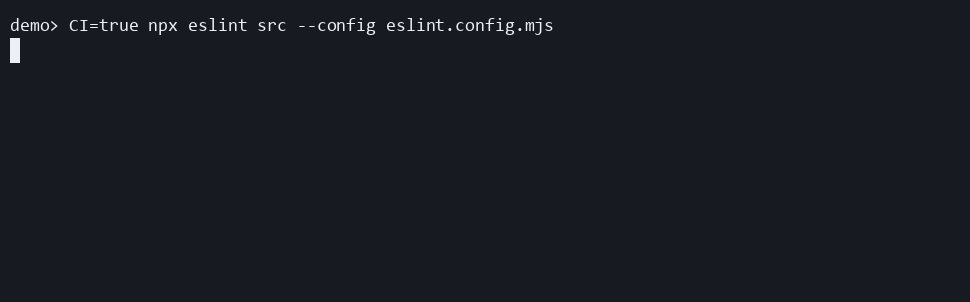

# recommended-ci

Use this preset when the same config is shared between local terminals and CI, and CI should suppress progress output entirely.

```ts
import progress from "eslint-plugin-file-progress-2";

export default [progress.configs["recommended-ci"]];
```

## Demo

[](../../docusaurus/static/demos/presets/recommended-ci.gif)

Notice that the full command is visible immediately, then the run stays quiet because CI output is hidden.

This demo captures a CI-like run. The preset intentionally suppresses live progress output and the final summary when `CI=true`.

[Recorded with VHS](https://github.com/charmbracelet/vhs#readme)

[Download the recorded cast](../../docusaurus/static/demos/presets/casts/recommended-ci.cast)

## What it changes

It enables [`file-progress/activate`](../../rules/activate.md) and sets `hide` from the current process `CI` value.

That means:

- local runs still show live progress
- CI runs suppress live output and the final summary

If you want CI to hide live output but still print a summary, use [`recommended-ci-detailed`](./recommended-ci-detailed.md) instead.
