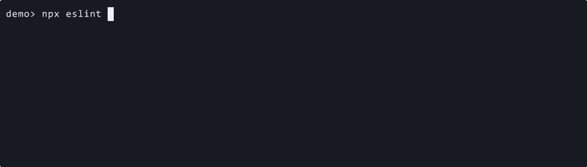

# recommended-compact

Use this preset when you want a live spinner but do not want per-file path repainting.

```ts
import progress from "eslint-plugin-file-progress-2";

export default [progress.configs["recommended-compact"]];
```

## Demo

[](../../docusaurus/static/demos/presets/recommended-compact.gif)

Notice that live feedback stays on one generic progress line instead of repainting each file path.

[Recorded with VHS](https://github.com/charmbracelet/vhs#readme)

[Download the recorded cast](../../docusaurus/static/demos/presets/casts/recommended-compact.cast)

## What it changes

- registers the `file-progress` plugin
- enables [`file-progress/compact`](../../rules/compact.md) at `warn`

This is the lowest-noise live mode the plugin ships with.
