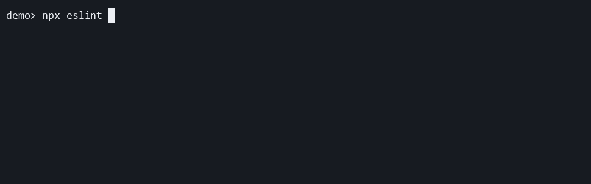

# recommended-detailed

Use this preset when you want the final success summary to include duration, file count, throughput, exit code, and problem status by default.

```ts
import progress from "eslint-plugin-file-progress-2";

export default [progress.configs["recommended-detailed"]];
```

## Demo

[](../../docusaurus/static/demos/presets/recommended-detailed.gif)

Notice that live file updates stay visible, then the final summary expands into aligned timing and throughput metrics.

[Recorded with VHS](https://github.com/charmbracelet/vhs#readme)

[Download the recorded cast](../../docusaurus/static/demos/presets/casts/recommended-detailed.cast)

## What it changes

It enables [`file-progress/activate`](../../rules/activate.md) with:

```ts
{
  detailedSuccess: true,
}
```

Use this preset when you want a richer completion summary but still want normal per-file live progress.
