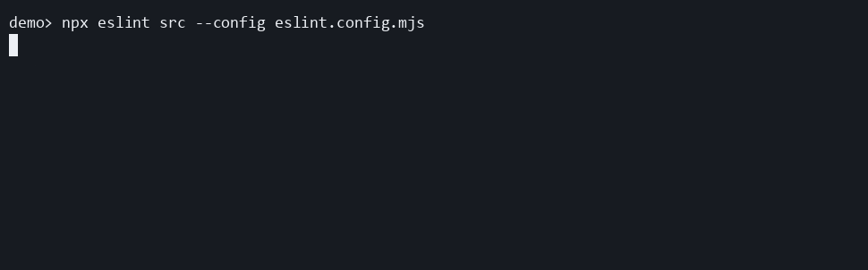

# recommended-summary-only

Use this preset when you only want the final summary line and no live updates while ESLint is running.

```ts
import progress from "eslint-plugin-file-progress-2";

export default [progress.configs["recommended-summary-only"]];
```

## Demo

[](../../docusaurus/static/demos/presets/recommended-summary-only.gif)

Notice that the command is shown up front, but no live progress appears before the single final success line.

[Recorded with VHS](https://github.com/charmbracelet/vhs#readme)

[Download the recorded cast](../../docusaurus/static/demos/presets/casts/recommended-summary-only.cast)

## What it changes

- registers the `file-progress` plugin
- enables [`file-progress/summary-only`](../../rules/summary-only.md) at `warn`

Choose this preset when deterministic output matters more than live feedback.
