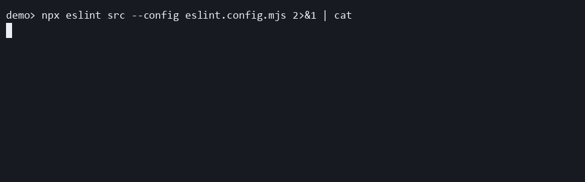

# recommended-tty

Use this preset when the config is shared across interactive terminals and non-interactive environments, and progress should only appear on a TTY.

```ts
import progress from "eslint-plugin-file-progress-2";

export default [progress.configs["recommended-tty"]];
```

## Demo

[](../../docusaurus/static/demos/presets/recommended-tty.gif)

Notice that the full command is visible immediately, but no plugin output appears because the capture is intentionally non-interactive.

This demo intentionally records a non-interactive capture. Because this preset sets `ttyOnly: true`, the plugin stays quiet when no TTY is available.

[Recorded with Asciinema Recorder and Agg](https://docs.asciinema.org/manual/cli/)

[Download the recorded cast](../../docusaurus/static/demos/presets/casts/recommended-tty.cast)

## What it changes

It enables [`file-progress/activate`](../../rules/activate.md) with:

```ts
{
  ttyOnly: true,
}
```

This is usually the safest preset for shared local/editor/automation configurations.
