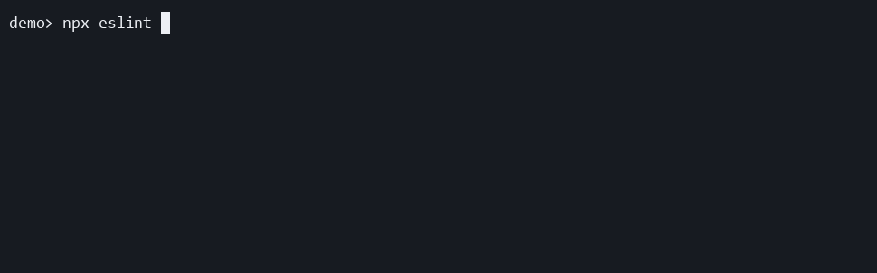

# recommended

Use this preset when you want standard per-file progress during local ESLint CLI runs.

```ts
import progress from "eslint-plugin-file-progress-2";

export default [progress.configs.recommended];
```

## Demo

[](../../docusaurus/static/demos/presets/recommended.gif)

Notice how the default preset shows each file path live and then ends with a short success line.

[Recorded with Asciinema Recorder and Agg](https://docs.asciinema.org/manual/cli/)

[Download the recorded cast](../../docusaurus/static/demos/presets/casts/recommended.cast)

## What it enables

- registers the `file-progress` plugin
- enables `file-progress/activate` at `warn`
- leaves all rule options at their defaults

This is the best starting point for most local terminal workflows.
